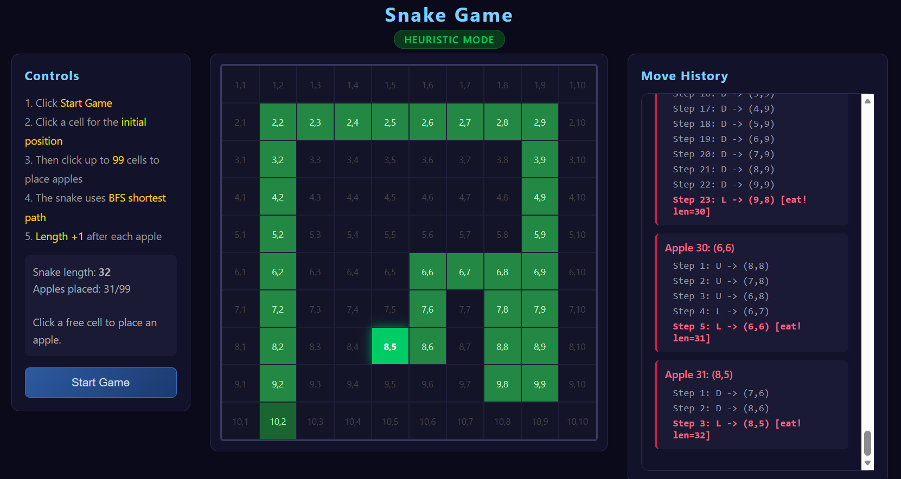
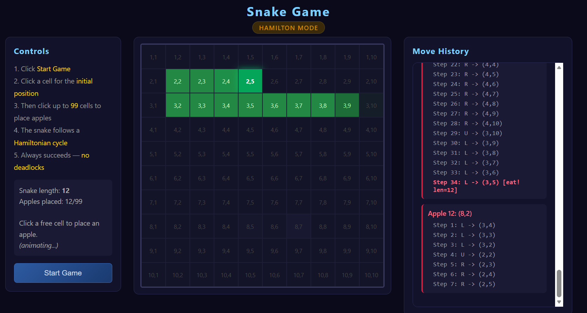

# Snake Game Visualization

A browser-based visualization of the **Snake** problem (Problem G) from the **ICPC Shenzhen Invitational Contest 2026**.

## Background

In this interactive problem, a snake starts at a given cell on an n×m grid. Apples appear one at a time on unoccupied cells. The snake must navigate to each apple without colliding with itself. Eating an apple grows the snake by length 1. The goal is to eat all n×m−1 apples.

This visualization implements two strategies to solve the problem on a 10×10 grid.

This project is a simple *vibe coding* one based on Xiaomi MIMO V2.5-Pro.

## Features

- **Heuristic Mode** — BFS shortest-path. The snake finds the optimal path to each apple, dynamically avoiding its own body. Fast but may get stuck when no path exists. Code designed based on this mode would not be able to be accepted, since it is easy to construct scenarios when snakes are restricted in a region surrounded by its own body.

  

- **Hamilton Mode** — Follows a precomputed 100-step Hamiltonian cycle. The snake traverses the grid in a fixed order, eating apples as it encounters them. Guaranteed to always succeed with no deadlocks.

  

- Interactive setup: click to choose the starting position, then place up to 99 apples.

- Real-time animation with move history logging.

- Single HTML file, no dependencies.

## How to Use

1. Open `snake.html` in any modern browser.
2. Choose **Heuristic Mode** or **Hamilton Mode**.
3. Click **Start Game**.
4. Click a cell to set the snake's starting position.
5. Click empty cells to place apples.
6. Watch the snake navigate to each apple automatically.

## Hamilton Cycle

The Hamiltonian cycle is encoded as a 100-character direction sequence:

```
DDDDDDDDDRRRRRRRRRULLLLLLLLURRRRRRRRULLLLLLLLURRRRRRRRULLLLLLLLURRRRRRRRULLLLLLLLL
```

Starting from (1,1), this sequence visits all 100 cells exactly once and returns to (1,1). The snake maintains a current index and advances one step per move, wrapping from index 100 back to index 1. Any apple is guaranteed to be encountered within ≤100 steps.

## License

MIT
